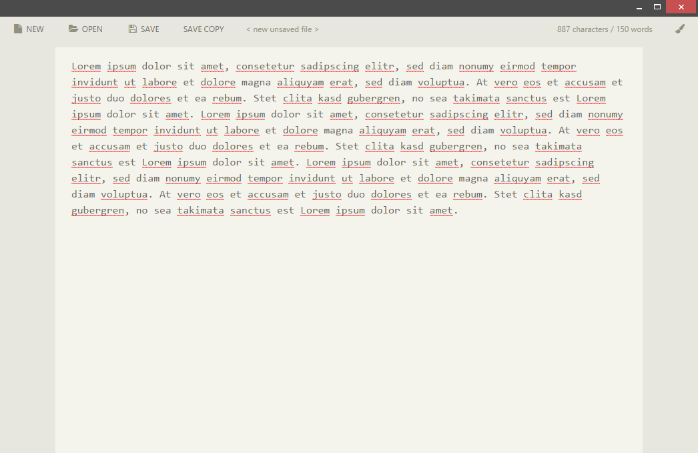
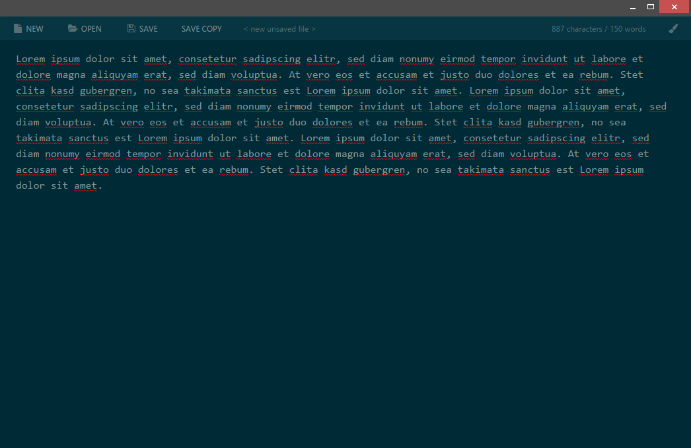
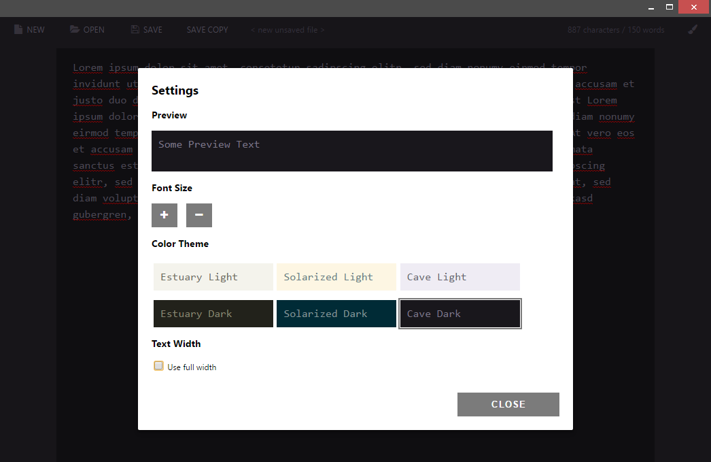

# Type Case

Type Case is a text editor for Chrome OS and the Chrome Browser. It's similar to Windows Notepad, plus some neat extras:

- 9 color themes
- Option to limit text width
- Character and word counter

## Contents

- [Keyboard shortcuts](#keyboard-shortcuts)
- [Screenshots](#screenshots)
- [Changelog](#changelog)

## Keyboard shortcuts

- `ctrl` + `n` = create a new file
- `ctrl` + `s` = save current file
- `ctrl` + `shift` + `s` = save as new file
- `ctrl` + `o` = open file
- `ctrl` + `,` = open settings
- `ctrl` + `+` = increase font size
- `ctrl` + `-` = decrease font size

## Screenshots

Light theme, limited line width

Dark theme, unlimited line width

Settings dialog

## Changelog

### 07.11.2016 - 0.5.3

- [FIX] 'Tab' key is now supported (but it won't be affected by Ctrl + Z undo. So be careful using it)
- [CHG] small UI clean up

### 11.08.2016 - v0.5.2

- [FIX] files couldn't be opened anymore due to an Chrome API change
- [NEW] added 3 new themes: Material Blue, Material Tael, Material Green
- [CHG] app uses the fonts "Open Sans" and "Source Code Pro" now
- [CHG] changed the settings dialog layout a little

### 07.09.2015 - v0.5.1

- [CHG] added option "offline_enabled" to manifest

### 06.09.2015 - v0.5.0

- [NEW] added icons
- [NEW] added settings to change themes, font size and text width (settings get synced)
- [NEW] new app icon
- [CHG] changed the user interface to play well with themes and small window sizes

### 03.09.2015 - v0.4.1

- [FIX] [ctrl] + [n/t] opened a new window/tab on Chrome OS

### 03.09.2015 - v0.4.0

- [NEW] added notifications to see what just happened
- [NEW] added keyboard shortcuts for saving, opening and creating a new file ([ctrl] + [N/O/S] and [ctrl] + [shift] + [s] for "save copy")
- [FIX] ask user to save changed files before opening a file via drag and drop
- [CHG] renamed "save as..." to "save copy"

### 02.09.2015 - v0.3.0

- [NEW] ask user to save changed files before opening or creating a new one
- [FIX] you can now open files from file explorer via double click while the app is running
- [FIX] added a few more file extensions like `.md` and `.js` so Type Case can be used as their default app.
- [FIX] display 1000 as 1,000 in the word counter (character depending on the machines locale settings)

### 01.09.2015 - v0.2.0

- [NEW] added support for "open with..." on Chrome OS (and maybe other systems that support it yet)
- [NEW] open files via drag'n'drop into the app is now possible
- [FIX] textarea now scales correctly with window width
- [FIX] application bar on top now uses multiple lines if necessary

### 01.09.2015 - v0.1.0

- Initial release
